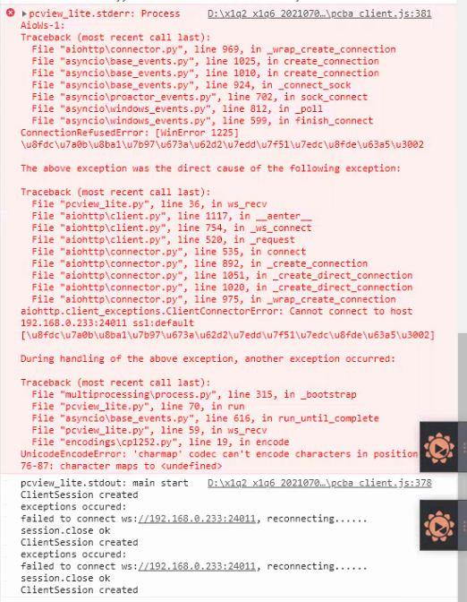

# Q76 搞清楚工厂出图测试失败的bug的来龙去脉？

## 版本说明

| 时间 | 版本 | 说明 |
| ---- | ---- | ---- |
| 2021-07-16 | 1.0.0 | 初稿 |

## 思路

出图测试时，上位机软件会调用pcview_lite.exe来接收并显示摄像头数据。出图测试失败，正是由于pcview_lite抛出异常导致的。

### 理解 pcview_lite 脚本

#### freeze_support 有什么用？

当你的python脚本使用了Multiprocessing模块，并且要使用pyinstaller将其打包为在Windows下运行的exe文件时，
你必须在main模块的第一行调用`multiprocessing.freeze_support()`。
在非Windows系统下运行这行代码不会产生任何效果。
